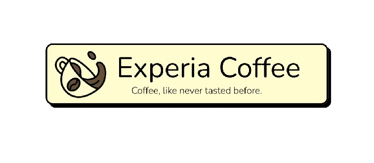

<h1 align="center">Experia Coffee - Coffee, like never tasted before</h1>

<p align="center">
  
  <br>
  <em>Experia coffee è un gestionale basato sulla vendita online di prodotti per il caffè
    <br> creato utilizzando HTML/CSS/Javascript/JQuery ed altri linguaggi.</em>
  <br>
</p>

<p align="center">
  <a href="https://github.com/Daevel/TecWeb-Project"><strong>Experia Coffee</strong></a>
  <br>
</p>

<hr>

### Per iniziare

Per eseguire il progetto correttamente, eseguire le seguenti istruzioni:

```bash
# Clona la repository del progetto
git clone https://github.com/Daevel/Experia-Coffee.git

# Naviga all'interno della directory di progetto
cd Experia-Coffee

# Effettua il compose per Docker
docker compose up --build
```

### Accortenze da seguire

Per eseguire il progetto correttamente, sono necessarie le seguenti istruzioni:
- Le porte 80, 3000 ed 3306 devono essere libere
- bisogna avere a disposizione una connessione ad internet
- bisogna aver installato correttamente Docker sulla propria macchina

<hr>

Autore : Avitabile Luigi 0124002627